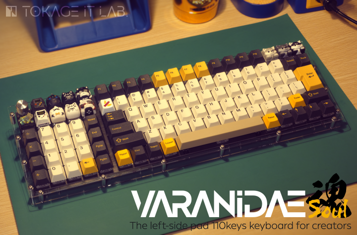
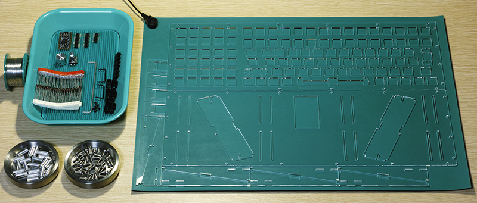
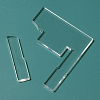
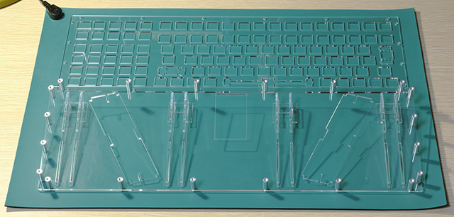
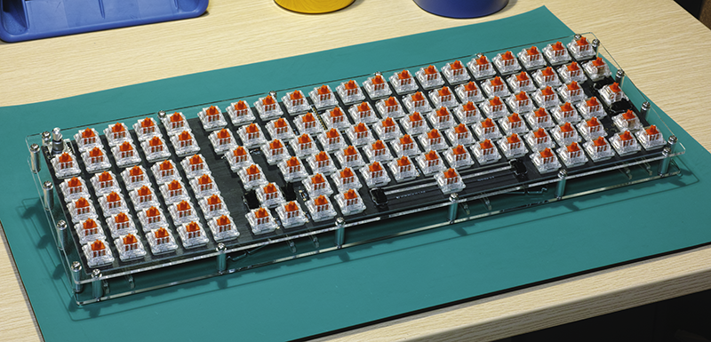
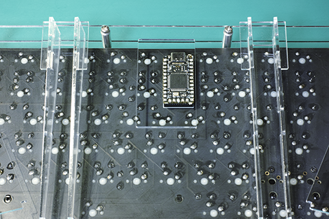

# Varanidae Soul

A minimal/cheap case of the [Varanidae](https://github.com/TokageItLab/Varanidae) keyboard with perfect compatibility of the plate.

## Description

This repository contains:

- case
  - Vector files of the plate/case
  - **The plates are assumed to be 2mm thick, please note when ordering plates using these files**
- img
  - Images for the readme

## Components

### Plates (2mm thickness)
- Main plate x1
- Bottom plate x1
- Leg parts x8
- Leg supporters x4

### Screws
- M3 screwed spacers 15mm x20
- M3 screws 8mm x40

### Other required components for the PCB
- Same with the [Varanidae#for-the-pcb](https://github.com/TokageItLab/Varanidae#for-the-pcb)

## Assemble guide
Insert the 8 legs onto the bottom plate. The legs will be held to the bottom plate by the protrusion, so you may need some force when inserting the legs, but never too much. Acrylic is more delicate than you may think, so you need to treat it as if you were handling a tiny gecko🦎 If the protrusion is too much, it is better to grind off the protrusion with a sandpaper.

Insert the leg supporters in 4 sets of 8 legs. Again, be careful not to add too much force.

Don't make the mistake like above...

If everything is fine with you so far, screw the spacers onto the bottom plate.

Mount the PCB on the plate to complete the process.

Never forget not to add too much force when attaching and removing the keycaps.

And, if you favor this layout, it may be worth ordering an original [Varanidae](https://github.com/TokageItLab/Varanidae) case to CNC Services. The main plate is completely compatible with that and can be reused without any modification, but just be careful that rotary encoder/switches are not soldered on at an angle and that the knobs are not too large.

## FAQ

### Legs are unstable

Once the main plate and bottom plate are connected, the acrylic should be stable to some extent, since the deflection of the acrylic will be reduced. If you are still concerned, using an adhesive may be fine.

### Backside hole looks misaligned

It is intended and no problem.

Elite-C is actually placed slightly shifted from the center of the PCB, but the hole on the back side should be centered for the strength of the acrylic bottom plate. The design shares part of the bottom plate with the legs and supporters to economy of materials, but if you are concerned about them, you can edit the bottom plate to cut the legs and supporters outside of the bottom plate.

## Special thanks (Artisan keycaps for the thumbnail)

- Art - [THOK](https://thok.design/)
- Banbani - [Sandun Art](https://www.sandun.art/)
- Chameleon - [THE EYE KEY](https://www.instagram.com/theeyekey/)
- Pocket Game Console - [ZMKC](https://www.instagram.com/zmkc_work/)
- Samsara - [GEEKKEEY](https://www.instagram.com/geekkeey/)
- Shibakey - [Matae Keycaps](https://www.instagram.com/mataekeycaps/)
- Xanne - [Meedee.key](https://www.instagram.com/meedee.key/)

## License

MIT license